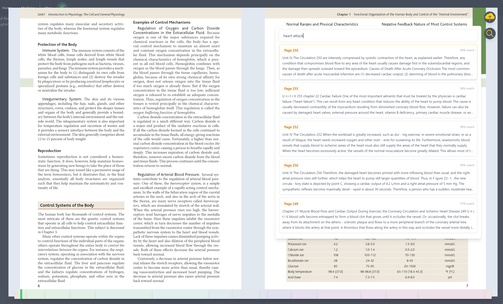
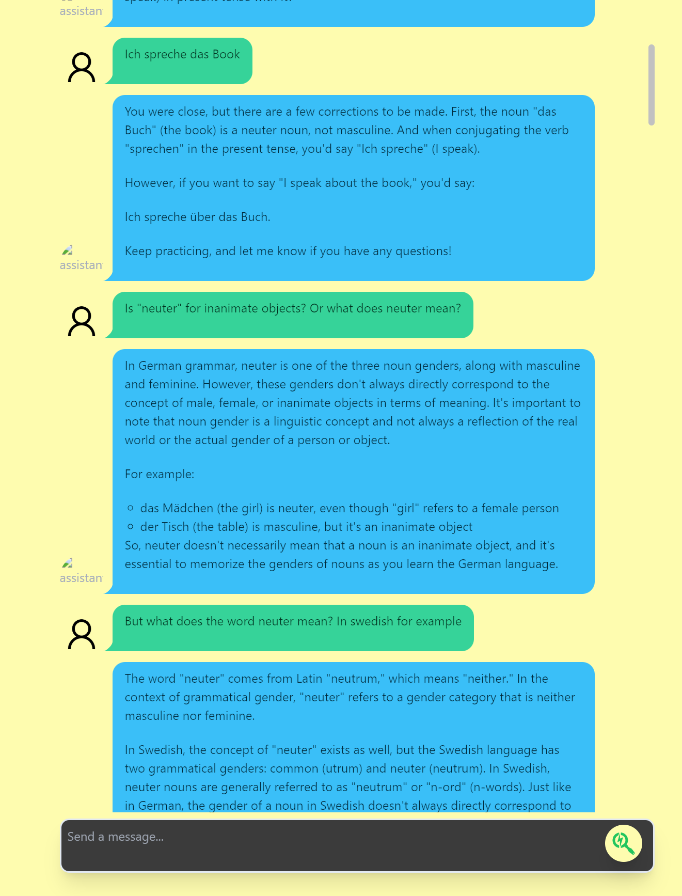
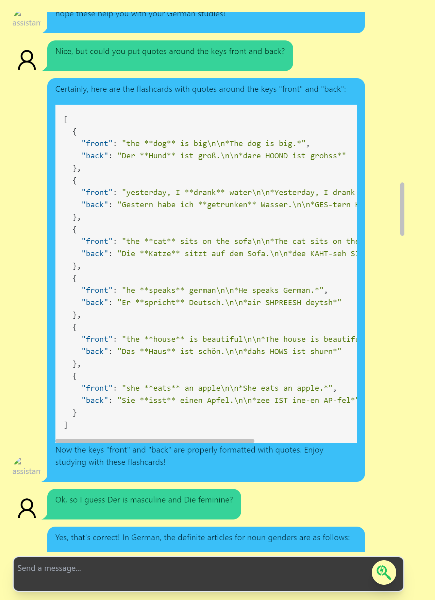
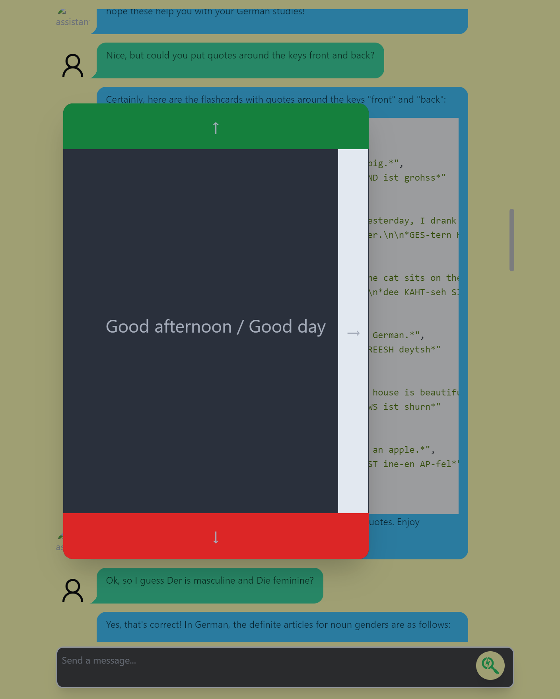

# Project Socrates
> An AI-powered learning platform with document retrieval, spaced-repetition flashcards, and interactive mind maps.

**Context:** This project was built during the summer of 2023, when GPT-4 had just come out. I had early access to the GPT-4 API, which at the time was locked behind a program where you had to contribute evaluation benchmarks to OpenAI to get in. This was how I first got into the LLM/AI application space.

Back then there were no established RAG frameworks or vector database ecosystems to lean on. I built the document retrieval pipeline from scratch: PDF text extraction, OpenAI embeddings, vector storage in Firestore, and client-side similarity search with TensorFlow.js. Today there are dedicated solutions for all of this, but building it from the ground up taught me a lot about how these systems actually work.

### Semantic PDF Search

Upload a PDF, generate page-level embeddings via OpenAI, and search the document using natural language. Results are ranked by vector similarity with TensorFlow.js.



### AI Tutor

Chat with a GPT-powered teacher in the context of a lesson.



### Flashcard Generation & Spaced Repetition

Ask the AI to generate flashcards from the lesson content. They come back as structured JSON and feed into a spaced repetition system (1d, 7d, 1mo, 3mo, 1yr).





## Features

* **AI Tutor** - Chat with a GPT-powered teacher scoped to a lesson. The AI stays on-topic and can quiz you on the material.
* **Document Retrieval (RAG)** - Upload PDFs, generate vector embeddings per page, and do semantic search across the content. Results link directly to the matching page.
* **Flashcards with Spaced Repetition** - Generate flashcards from lesson content using GPT. Reviews follow a spaced repetition schedule (1 day, 7 days, 1 month, 3 months, 1 year).
* **Mind Maps** - Conversation topics laid out spatially in an interactive map built on Leaflet.js.
* **Custom PDF Viewer** - Text layer, table of contents visualization, double-page spread, swipe navigation, persistent reading position.

## Tech Stack

| Layer | Tech |
|-------|------|
| Framework | SvelteKit, Svelte 3, TypeScript |
| Styling | Tailwind CSS, DaisyUI |
| AI | OpenAI API (chat completions, embeddings) |
| Vector Search | TensorFlow.js (client-side similarity) |
| Database | Firebase Firestore (real-time sync) |
| Auth | Firebase Authentication |
| Storage | Firebase Cloud Storage + IndexedDB (offline cache) |
| PDF | PDF.js (rendering, text extraction) |
| Maps | Leaflet.js |
| Markdown | Remark + Rehype (KaTeX math, syntax highlighting) |

## Setup

1. Clone the repo and install dependencies:
```bash
npm install
```

2. Copy `.env.example` to `.env` and fill in your OpenAI API key:
```bash
cp .env.example .env
# edit .env and set OPENAI_API_KEY=sk-...
```

3. (Optional) For server-side Firestore features, place your Firebase Admin SDK credential at:
```
secret/project-socrates-firebase-admin-sdk.json
```
Download from: Firebase Console > Project Settings > Service Accounts > Generate New Private Key.

4. Start the dev server:
```bash
npm run dev
```

The app uses Firebase Authentication. Sign in or create an account on the login screen.
